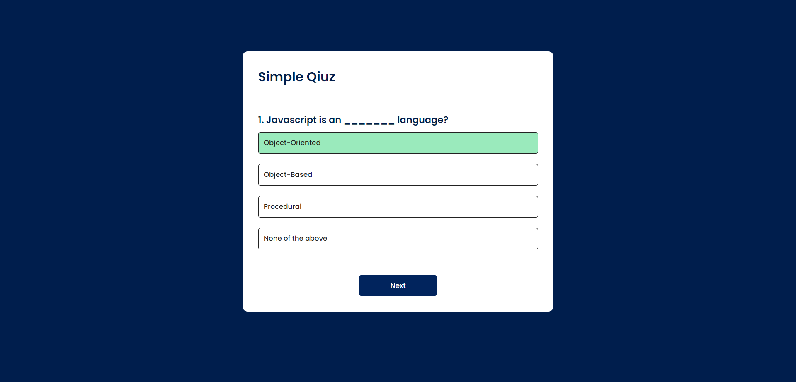
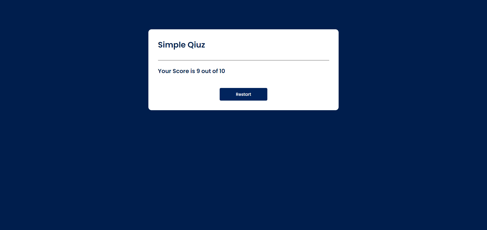

# Quiz-app Project


This project is written by HTML, CSS and Javascript .

## Result:


------

------

## Code:
### Functions
#### 1- Question Format `questions[{-:"",-:[{}]}]`
##### that contain data and questions

```javascript
const questions =[
    {
        question:"Javascript is an _______ language?",
        answers:[
            {text:"Object-Oriented",correct:true},
            {text:"Object-Based",correct:false},
            {text:"Procedural",correct:false},
            {text:"None of the above",correct:false}
        ]
    }
    ];
```
------
#### 2- To start Quiz `startQuiz()`
##### This function is used to start quiz
```javascript
 function startQuiz()
{
    currentQuestionIndex = 0;
    score = 0;
    nextButton.innerHTML = "Next";
    showQuestion();
}
```
------
#### 3- To show data from local storage `showData()`
##### This function is used to show user data from the page's local storage
```javascript
 function showQuestion()
{
    resetState();
    let currentQuestion= questions[currentQuestionIndex];
    let questionNo = currentQuestionIndex + 1;
    questionElement.innerHTML = questionNo+". "+currentQuestion.question;

    currentQuestion.answers.forEach(answer => {
        const button = document.createElement("button");
        button.innerHTML = answer.text;
        button.classList.add("btn");
        answerButton.appendChild(button);
        if(answer.correct)
        {
            button.dataset.correct = answer.correct;
        }
        button.addEventListener("click",selectAnswer);
    
    });
```
